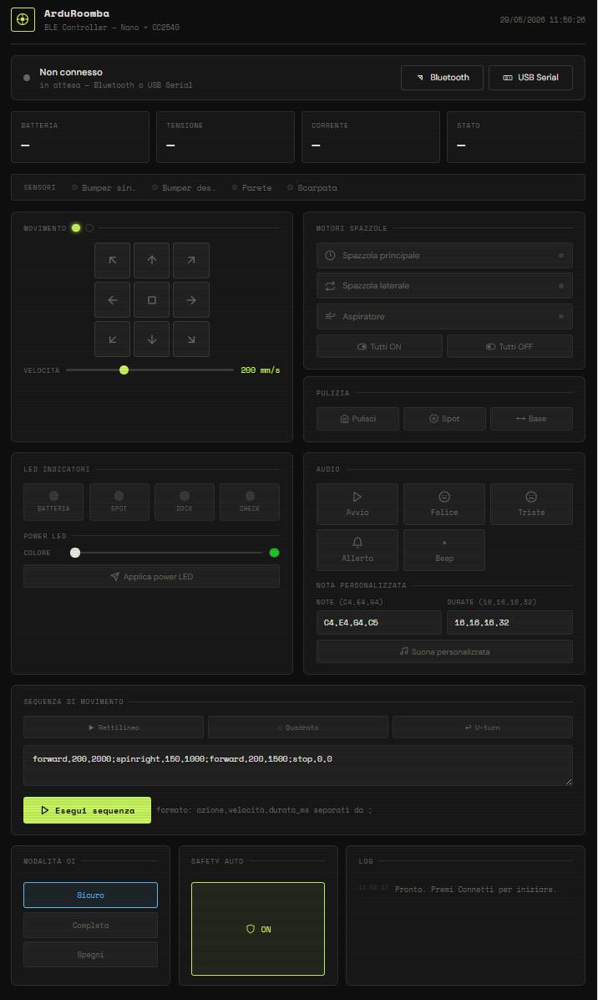

# ArduRoomba - NanoBLE Full Controller

Un sistema di controllo avanzato per irobot Roomba basato su **Arduino Nano** e modulo **Bluetooth Low Energy (BLE) CC2540**. Il progetto include uno sketch Arduino ottimizzato e una moderna interfaccia web di controllo.

## 🚀 Caratteristiche

- **Controllo Totale del Movimento:** D-Pad interattivo e supporto Joystick per movimenti fluidi.
- **Gestione Attuatori:** Controllo indipendente di spazzola principale, spazzola laterale e aspiratore.
- **Feedback Sensori in Tempo Reale:** Monitoraggio di batteria (tensione, corrente, percentuale), bumper, sensori di vuoto (cliff) e muro.
- **Luci e Suoni:** Gestione dei LED di stato (Spot, Dock, Check, Power LED personalizzabile) e riproduzione di melodie o note MIDI.
- **Sequenze Programmabili:** Possibilità di inviare stringhe di comando per eseguire movimenti complessi.
- **Doppia Connettività:** Supporto per **Web Bluetooth** e **Web Serial (USB)** direttamente dal browser.

## 🛠️ Hardware Necessario

- **iRobot Roomba** (Serie 500/600/700/800 dotati di porta Mini-DIN a 7 pin).
- **Arduino Nano V3.0** (o compatibile ATmega328P).
- **Modulo BLE CC2540** (es. HM-10, BT05 o cloni).
- **Cavi di collegamento** e connettore Mini-DIN 7 pin.

## 🔌 Cablaggio (Roomba → Nano + CC2540)

| Roomba Pin | Funzione | Arduino Pin | Note |
|------------|----------|-------------|------|
| Pin 4      | TX       | D2          | SoftwareSerial RX |
| Pin 3      | RX       | D3          | SoftwareSerial TX |
| Pin 5      | BRC/DD   | D4          | Baud Rate Change / Device Detect |
| Pin 6/7    | GND      | GND         | Massa comune |

*Nota: Il modulo BLE CC2540 è collegato alla Serial hardware dell'Arduino (RX0/TX1) per la massima affidabilità di comunicazione.*

## 💻 Installazione e Uso

### 1. Caricamento Sketch
1. Assicurati di avere la libreria `ArduRoomba.h` (inclusa nel progetto) nella cartella delle librerie Arduino.
2. Apri `ArduRoomba_NanoBLE_Full.ino` nell'IDE di Arduino.
3. Seleziona la scheda **Arduino Nano** e il processore **ATmega328P**.
4. Carica lo sketch.

### 2. Interfaccia Web (`arduroomba-controller.html`)
1. Apri il file `arduroomba-controller.html` in un browser moderno (Chrome o Edge consigliati).
2. Assicurati che il Bluetooth sia attivo sul tuo PC/Smartphone.
3. Clicca su **"Bluetooth"** per cercare il dispositivo (nome predefinito: `ArduRoomba`).
4. In alternativa, collega l'Arduino via USB e clicca su **"USB Serial"**.

## 📱 App Consigliate (Mobile)
Se non utilizzi l'interfaccia HTML fornita, puoi usare queste app per inviare comandi via BLE:
- **Android:** "Serial Bluetooth Terminal" di Kai Morich.
- **iOS/Mac:** "LightBlue" o "nRF Connect".

---
*Progetto sviluppato per appassionati di robotica e domotica.*
